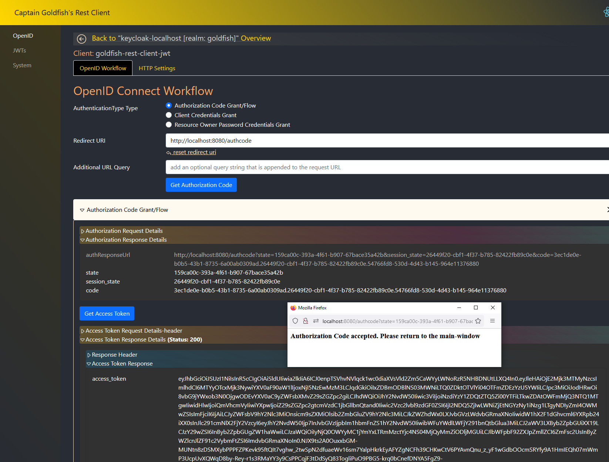

# OAuth2 Client

This project is a test-program that I started developing in order to learn react. It can be used to build and parse JWTs
of type JWS and JWE. It has support for RSA and EC keys and allows the user to access Oauth2/OpenID Connect Providers to
get access tokens for the following grants (see also screenshot):

1. Authorization Code Grant
2. Client Credentials Grant
3. Resource Owner Password Credentials Grant

It allows you to take a direct look at request and response details which can be used for teaching purposes.

The project supports basic-authentication and JWT authentication.

This project is not feature complete and was created to make lifetime easier for people who regularly need to check on
AccessTokens on any Identity Provider.



The project is based on springboot and needs a database connection which can be setup like this in
`application.properties` file
   
the following is the default configuration

```properties
database.url=jdbc:hsqldb:file:./hsql-db/application-db
database.user=sa
database.password=
```
    
to use other database use e.g.

```properties
database.url=jdbc:mysql://localhost:3306/goldfishs_rest_client
database.user=root
database.password=123456
logging.config=./config/log4j2.xml
```

Please note that the frontend is pretty poorly implemented due to inexperience with javascript I created several design
problems that would actually require the frontend to be reimplemented.

# Requirements

The project requires JDK 11+

# Supported databases

|  type |
| :---- | 
| MySQL | 
| MariaDB |
| MS SQL Server |
| Oracle XE |
| Postgres |
| HSQLDB  |

# Build
               
1. Install npm packages for the React frontend build: `mvn clean process-resources -DskipTests -P npm-install`. This must be executed only once. (NOTE: the build will fail on the `application`-module. Ignore the build-failure. This command is just for installing a local node-setup)
2. Build the artifact with `mvn clean package -DskipTests -P npm-build`
3. The executable artifact can be found at `application/target/oauth2-test-client.jar` after `mvn clean package`
